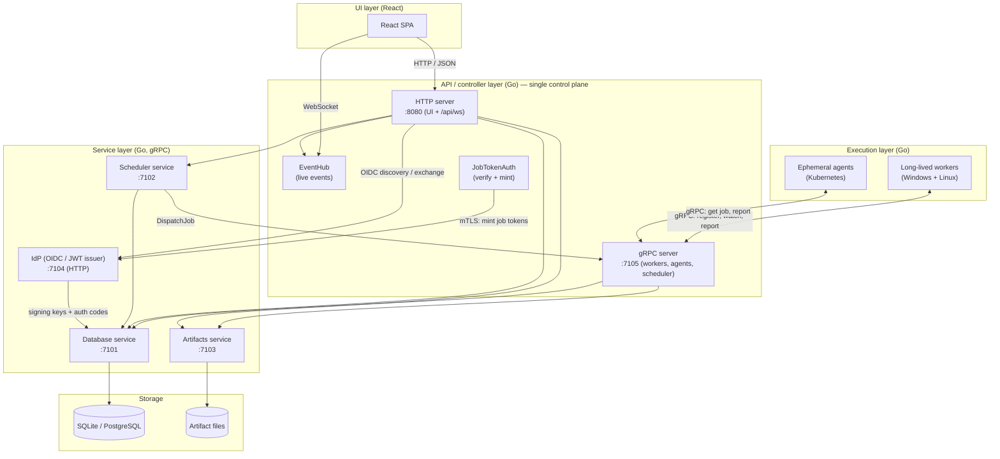
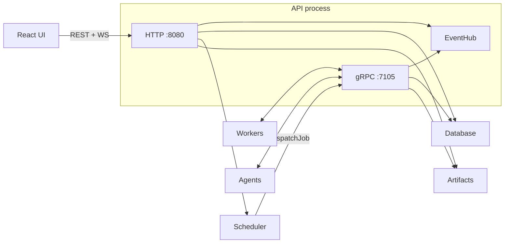
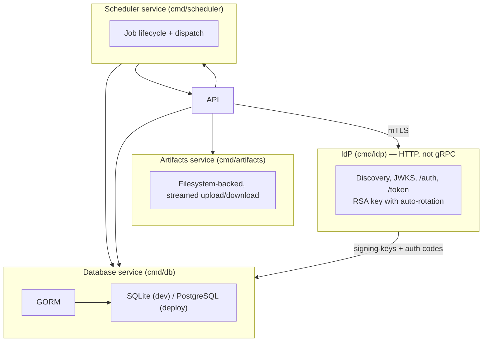
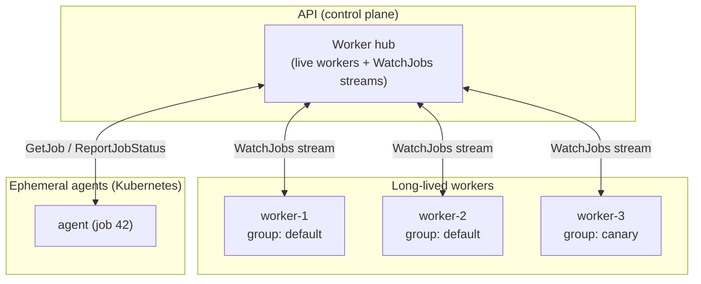
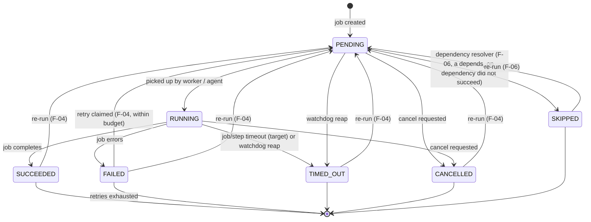
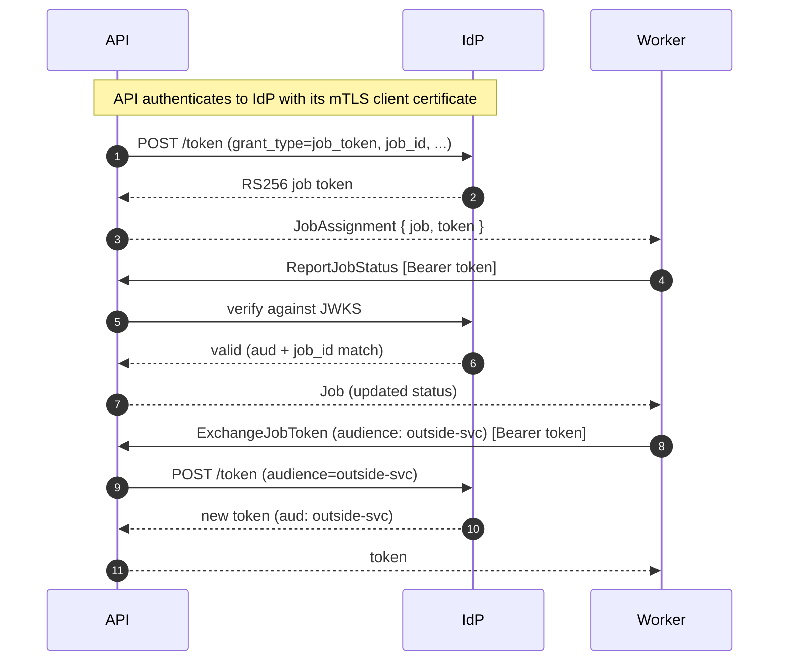
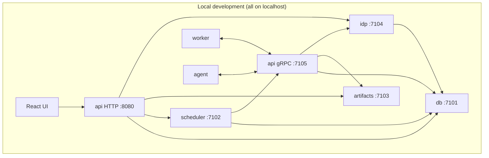

# Cdrom — Architecture

Cdrom (continuous delivery runtime, orchestrator and manager) is a pipeline
tool: it defines, schedules, and executes pipeline jobs across distributed
execution targets. This document describes the overall architecture of the
system as it stands today.

The design is an **N-tier architecture** built around a single control plane.
Everything except the frontend is written in Go; the frontend is React.

---

## 1. High-level view

The system is organized into four layers, top to bottom:

1. **UI layer** — a React single-page app (the only non-Go component).
2. **API / controller layer** — a Go service that is the **single control
   plane**. It exposes an HTTP API to the UI *and* a gRPC API to execution
   targets and the scheduler. It holds no business logic of its own.
3. **Service layer** — standalone Go services, one per concern, each exposing
   a gRPC interface: **Database**, **Scheduler**, **Artifacts**, and the local
   **IdP** (an HTTP OIDC identity provider / JWT issuer).
4. **Execution layer** — where jobs actually run: long-lived **workers** and
   ephemeral **agents**.



### Topology rule

> **Execution targets (workers, agents) talk *only* to the API.** The API is
> the single control plane and talks to everything else (database, scheduler,
> artifacts, IdP). There is no central logs service — every process logs
> locally to stdout or a file.

This means a worker or agent never dials the database, scheduler, or artifacts
service directly. Artifact traffic from execution targets is **proxied**
through the API to the artifacts service.

---

## 2. The API / control plane

The API process serves **two surfaces** from one binary:

- **HTTP** (`:8080`) — consumed by the UI. Routes requests to the gRPC
  services (pipelines → database, jobs → scheduler, artifacts → artifacts) and
  hosts the `/api/ws` WebSocket endpoint for live events.
- **gRPC** (`:7105`) — consumed by workers, agents, and the scheduler. This is
  the control-plane hub: it holds the workers' `WatchJobs` streams, relays job
  assignments pushed by the scheduler (`DispatchJob`), and proxies artifact
  traffic.



The gRPC surface exposes these RPCs (see `proto/cdrom/api/v1/api.proto`):

| Group | RPCs | Called by |
|-------|------|-----------|
| Worker lifecycle | `RegisterWorker`, `DeregisterWorker`, `Heartbeat` | workers |
| Execution | `WatchJobs` (server stream), `GetJob`, `ReportJobStatus` | workers, agents |
| Token exchange | `ExchangeJobToken` | workers, agents |
| Dispatch | `DispatchJob`, `NotifyJobStatus`, `CancelJob` | scheduler |
| Artifact proxy | `UploadArtifact`, `DownloadArtifact`, `GetArtifact`, `ListArtifacts`, `DeleteArtifact` | workers, agents |
| Job logs | `StreamJobLogs` (client stream) | workers, agents |

---

## 3. Service layer

Each service is a **standalone process** exposing a gRPC interface (protos in
`proto/cdrom/<service>/v1/`, generated code committed under `internal/gen/`).



- **Database** (`cmd/db`) — owns the storage backend (SQLite for local dev,
  PostgreSQL for deployments) and is the **only** component allowed to touch
  it. All other components read/write data through its gRPC API. Schema is
  derived from the GORM models in `internal/models` via `AutoMigrate` — no
  hand-written SQL or migration scripts.
- **Scheduler** (`cmd/scheduler`) — manages job lifecycle and dispatch. It
  holds **no durable state of its own**; all pipelines and jobs are persisted
  through the Database service. When a job targets a worker group it pushes it
  to the API (`DispatchJob`), which fans it out to the live workers.
- **Artifacts** (`cmd/artifacts`) — a general-purpose, **namespaced file
  store**, filesystem-backed with streamed uploads/downloads. Every file lives
  in an opaque *namespace* that groups related files; the service is agnostic
  about what a namespace means. A job's artifacts and logs use the job's id as
  the namespace, while a deployed release's artifacts might use a release
  identifier — so the same store holds both job-owned and deployed/published
  artifacts. It also provides **job-log storage**: the API persists a job's
  streamed step output here (one file per step, `step-<n>.log`, plus a
  combined `job.log`, under `<root>/<namespace>/logs/` where the namespace is
  the job id) via the `AppendLog`/`DownloadLog`/`GetLog`/`ListLogs` RPCs. The
  store is an interface with a filesystem implementation; the store kind is
  configurable (`artifacts_store` / `CDROM_ARTIFACTS_STORE`, default
  `filesystem`) so S3 / Azure Blob can be added later.
- **IdP** (`cmd/idp`) — a local OIDC identity provider that acts as a JWT
  issuer for the API's OIDC authentication. It is an **HTTP** service (not
  gRPC) serving the discovery doc, JWKS, authorization, and token endpoints,
  and it rotates its RSA signing key automatically. It also mints **job
  tokens** (see §6). Unlike the other services, the IdP keeps **no state on
  its local filesystem**: its signing keyring and its OIDC authorization
  codes are persisted through the Database service, so multiple IdP replicas
  share the same keys and codes and can run behind a load balancer (the IdP
  requires the db service to be running).

### gRPC conventions

- All inter-component communication is gRPC. When a TLS CA is configured
  (`tls` section of the config), every connection uses **mutual TLS**: servers
  present their certificate and require clients to present one signed by the
  shared CA; clients verify the server against the CA. When no CA is
  configured, connections fall back to plaintext (local development).
- mTLS credentials are built in `internal/grpcutil` (`ServerCreds` for
  servers, `ClientCreds` for clients) from the `tls` section of the config.
- Service implementations live in `internal/services/<service>/server.go` and
  implement the generated `*Server` interface (embedding
  `Unimplemented*Server`).
- Shared gRPC plumbing (client dial, serve-until-signal, TLS credentials) is in
  `internal/grpcutil`.

---

## 4. Execution model

There are two kinds of execution targets, both of which talk **only** to the
API:



- **Long-lived workers** — resident processes on deployment targets. Workers
  are **targetable by group**: a job can be dispatched to all (or a selection
  of) workers in a named group. A worker registers with the API and holds a
  `WatchJobs` stream open; the API pushes `WatchMessage`s down the stream — a
  `JobAssignment` (a new job to run) or a `JobCancellation` (stop a job the
  worker is running, F-05). Workers must run on **Windows and Linux**.
- **Ephemeral agents** — short-lived processes that spin up in **Kubernetes**
  when a one-off job runs, execute it, and terminate. An agent fetches its job
  from the API (`GetJob`), reports status back to the API, and exits. An agent
  holds no `WatchJobs` stream, so it observes a cancellation (F-05) by polling
  `GetJob` while the job runs. Agents must also run on **Windows and Linux**.

A job with a **non-empty** `target_group` is dispatched to live workers in that
group. A job with an **empty** `target_group` is left pending for an ephemeral
agent.

### Job execution spec

A job carries a declarative **`JobSpec`**: an ordered list of **steps**. Each
step is **agnostic about how it runs**: a `type` field selects a step handler,
and the handler reads everything it needs from the common fields (`workdir`,
`env`, `timeout`) and from `params`. Handler-specific settings live in `params`
(a map of name → value, where a value is either a scalar string or a list of
strings), not in the step's own fields, so a new step type can be added without
changing the spec schema. The built-in **`shell`** handler (also the default
when `type` is empty) runs a command — directly, or through a user-chosen
shell — reading its `command`, `args`, and `shell` from `params`. The
canonical type is `cdrom.db.v1.JobSpec`; the API and scheduler protos
reference it rather than redefining it.

- **Per-run snapshot.** The spec is stored on the `Job` row (a JSON `text`
  column via GORM's `serializer:json`), snapshotted when the job is created.
  Editing a pipeline therefore never changes what a past run did.
- **Shared executor.** Both workers and agents run the spec through
  `internal/executor` (`executor.Execute(ctx, spec, logger)`): steps run in
  order and the job fails on the first step that errors. A job with no spec is
  a no-op that succeeds.
- **Step types & handlers.** The executor (`internal/executor`) is the generic
  dispatch engine: it selects an `executor.StepHandler` by the step's `type`
  (empty → the handler registered under `executor.DefaultType`) and runs it.
  The concrete handlers live in `internal/stephandlers`; the built-in
  **`shell`** handler registers itself under `executor.DefaultType` at package
  init, so a step with no type runs through it. A target or plugin adds new
  step types with `executor.RegisterStepType(name, handler)` (e.g. `ansible`,
  `terraform`, `argo`). A step whose type is not registered on the target
  fails the job with a clear error. `params` carries handler-specific
  configuration so a new step type can be added without changing the spec
  schema. The worker and agent blank-import `internal/stephandlers` so the
  built-in handlers are registered before any job runs. This is the seam for
  the later plugin architecture: writing a new step type is a matter of
  registering a handler, not changing the executor core.
- **Shell contract (portability, shell handler).** The shell handler reads its
  `command` (string param), `args` (list param), and `shell` (string param)
  from the step's `params`. The command is executed **directly by the target
  OS — no implicit shell**. This is what makes a spec portable across Windows
  and Linux (no `&&`, pipes, globbing, or `$VAR` expansion). A step that needs
  shell behavior invokes a shell explicitly (`sh -c ...` on Linux, `cmd /c ...`
  on Windows). Step stdout/stderr are inherited from the target's own
  stdout/stderr (local logging) and, when the target has a log sink, also
  streamed to the API in near-real-time (F-02, `internal/logstream`); the API
  persists the output to the artifacts service and fans it out to the UI as
  `job_log` events.
- **Timeouts (F-03).** A job declares a job-level `timeout` on its `JobSpec`
  (the sum of all steps) and each step may declare its own `timeout` (an
  individual step); whichever deadline expires first terminates the job. The
  executor derives a context for the job-level timeout in `Execute` and a
  nested context for a step's timeout in `runStep`, cancelling the running
  step when a deadline passes. A job with no job-level and no per-step timeout
  runs unbounded. When a deadline expires the executor returns the sentinel
  `executor.ErrTimeout`; the worker and agent check `errors.Is(err,
  executor.ErrTimeout)` and report the terminal status `timed_out` (distinct
  from `failed`). As a safety valve for a target that goes silent, the
  scheduler runs a background **watchdog** that reaps running jobs past their
  effective timeout (job-level timeout, else the longest per-step timeout) via
  the conditional `Database.ReapJob` RPC and tells the API (`NotifyJobStatus`)
  to fan the status change out to the UI.
- **Retry & re-run (F-04).** A job's `JobSpec` may carry a `retry` policy:
  `max_attempts` (the number of retries *after* the initial attempt — a job
  with `max_attempts: 2` runs at most 3 times; `0`/absent means never
  retried) and `backoff` (a duration to wait before each re-dispatch). A
  retry is a new attempt on the **same `Job` row** — the `Job` carries an
  `attempt` counter (starts at 1) and a denormalized `max_attempts` (copied
  from the spec at creation) so the pipeline run stays coherent and the UI
  can show "attempt N of M". The scheduler runs a background **retry loop**
  that periodically asks the database for the jobs that still have retries
  remaining (`Database.ListRetriableJobs` — failed jobs with `max_attempts >
  0` and `attempt < max_attempts + 1`, filtered in the database so the loop
  never pulls every failed job over the wire) and, for each, claims the next
  attempt through the conditional `Database.ClaimJobRetry` RPC (atomically
  resets the job to `pending` with `attempt + 1` and a cleared `finished_at`;
  rejects jobs that succeeded, were cancelled, or exhausted their budget) and
  re-dispatches it through the API — immediately, or after the policy's
  `backoff` delay.
  Separately, a user can **re-run** any finished job (succeeded, failed,
  cancelled, or timed out) via `POST /api/jobs/{id}/rerun` (API → scheduler
  `RerunJob` → `Database.RerunJob`): the job is reset to `pending` with
  `attempt` back to 1 and re-dispatched, producing a fresh execution.
  `attempt`/`max_attempts` are carried on the job protos (db, scheduler, api)
  and surfaced to the UI through the WebSocket snapshot and `job_status`
  events.
- **Cancellation propagation (F-05).** Cancelling a running job signals the
  execution target to stop the work (terminate the running command), not just
  flip the status in the database. `POST /api/jobs/{id}/cancel` (API →
  scheduler `CancelJob`) persists the cancellation with the conditional
  `Database.CancelJob` RPC (marks the job `cancelled` only if it is still
  `pending` or `running`, so cancelling a finished job is a no-op) and then
  signals the target through the API's `CancelJob` RPC. The API's `WatchJobs`
  server stream carries a `WatchMessage` (a oneof of `JobAssignment` and
  `JobCancellation`): the API pushes a `JobCancellation` down every live
  worker's stream, and a worker that is running the job interrupts the running
  step (cancelling the job's context, which terminates the command) and
  reports `cancelled`; a cancellation for a job that is not running on that
  worker is ignored. An ephemeral agent holds no `WatchJobs` stream, so it
  observes the cancellation on the API instead: it polls `GetJob` on a short
  interval while the job runs and, when it sees the job is `cancelled`,
  interrupts the running step and reports `cancelled`. Signalling the target
  is best-effort: if it cannot be reached (no live worker, or the API is down)
  the job is still marked `cancelled` in the database, and the target's next
  status report (or the scheduler's watchdog) reconciles it. A late target
  report cannot clobber a terminal status: `Database.UpdateJob` applies a
  target's status report only if the job is still `pending` or `running`, so
  once a job is `succeeded`, `failed`, `cancelled`, or `timed_out` a late
  report (e.g. a target that finished just as it was cancelled) is ignored.
- **Skip propagation & step conditions (F-06).** A job or step can be
  skipped — never run — instead of failing, in two ways:
  - *Step `condition`.* A step's `condition` param is a Go template
    (`text/template`) rendered against the step's own `Env`; the rendered
    output is parsed as a boolean (`strconv.ParseBool`). An empty `condition`
    never skips (unchanged default behavior). A `condition` that renders to
    `false` marks the step `skipped` and the executor moves on without
    running it or failing the job. A `condition` that fails to render or
    parse as a boolean is a spec error: it fails the job (the step is not
    skipped). Each step's terminal outcome (`succeeded`/`failed`/`skipped`/
    `timed_out`, plus an error message when applicable) is collected by the
    execution target through an `executor.StepStatusReporter` set in the
    executor's context (`executor.StepResultCollector`, mirroring the
    `LogSink` context pattern) and attached to the job's final
    `ReportJobStatus` call as `step_results`; the API forwards them to
    `Database.UpdateJob`, which persists them unconditionally (informational,
    not part of the terminal-status guard).
  - *Job `depends_on` (dependency skip propagation).* A job may declare
    `depends_on` — a list of other job ids. `SubmitJob` persists it and, for
    a job with any dependency, does **not** dispatch it immediately; the job
    is left `pending`. The scheduler runs a background **dependency
    resolver** that periodically lists pending jobs with a non-empty
    `depends_on` and, for each, checks every dependency's status
    (`Database.GetJob`): if any dependency reached a terminal state other
    than `succeeded` (`failed`, `cancelled`, `timed_out`, or itself
    `skipped`), the job is marked `skipped` (`Database.SkipJob`, conditional:
    only from `pending`) and the scheduler fans it out to the UI
    (`API.NotifyJobStatus`) — this is what makes skip **propagate**
    transitively through a dependency chain, one resolver tick at a time. If
    every dependency `succeeded`, the job is released: its `depends_on` is
    cleared (`Database.UpdateJob` with `clear_depends_on`, so the resolver
    does not reconsider — and re-dispatch — it next tick) and it is
    dispatched exactly as `SubmitJob` would have for a job with no
    dependencies. A dependency still `pending`/`running` leaves the job
    untouched for the next tick.

    **This is a deliberately minimal, single-level, polling-based stand-in
    for F-08's full DAG/`needs` resolver**, since F-06 lands ahead of F-08 in
    the roadmap. `depends_on` is a flat list of raw job ids with no cycle
    validation; F-08 is expected to replace it with a named `needs` (job keys
    within a pipeline run), full parallel DAG resolution, and cycle
    validation at save time.
- **Shell override (shell handler).** A step may set the `shell` param to run
  through a user-chosen interpreter instead of executing `command` directly.
  When `shell` is set the target executes `<shell> <args> <command>` — `args`
  are the shell's own flags and `command` is passed as the final argument
  (e.g. `shell: "pwsh"`, `args: ["-NoProfile", "-Command"]`,
  `command: "Get-ChildItem"`). This is the portable way to opt a step into
  shell behavior with a specific shell rather than a platform default. When
  `shell` is empty the step runs `command` directly, preserving the
  no-implicit-shell contract.

---

## 5. Job lifecycle

The flow below shows how a job submitted from the UI travels through the
system to a long-lived worker and back.

```mermaid
sequenceDiagram
    autonumber
    participant UI as React UI
    participant API as API (control plane)
    participant SCHED as Scheduler
    participant DB as Database
    participant W as Worker (group)

    UI->>API: POST /api/jobs (name, target_group, depends_on, spec)
    API->>SCHED: SubmitJob (spec, depends_on)
    SCHED->>DB: CreateJob (persist spec snapshot + depends_on)
    DB-->>SCHED: job (pending)
    alt depends_on set
        Note over SCHED: job left pending; dependency resolver (F-06) handles it
    else target group set
        SCHED->>API: DispatchJob (job + spec)
        API->>API: mint job token (via IdP)
        API-->>W: WatchJobs stream: JobAssignment (job + spec, + token)
    else empty target group
        Note over SCHED: job left pending for an ephemeral agent
    end
    SCHED-->>API: job
    API-->>UI: job

    W->>W: run spec steps in order (internal/executor), evaluating each step's condition (F-06)
    W->>API: ReportJobStatus (running) [Bearer token]
    W->>API: UploadArtifact (streamed, proxied)
    W->>API: ReportJobStatus (succeeded/failed/timed_out) [Bearer token]
    API->>DB: UpdateJob (status, step_results)
    API-->>UI: /api/ws event: job_status
    Note over SCHED,DB: watchdog: if a job runs past its timeout and the target goes silent, SCHED reaps it (DB.ReapJob → timed_out) and tells the API (NotifyJobStatus) to fan it out to the UI
    Note over SCHED,DB: retry loop (F-04): SCHED asks the DB for retriable jobs (DB.ListRetriableJobs — failed and within budget), claims each next attempt (DB.ClaimJobRetry → pending, attempt+1) and re-dispatches it via the API after the policy's backoff
    Note over UI,W: cancel (F-05): UI → API POST /api/jobs/{id}/cancel → SCHED CancelJob → DB.CancelJob (cancelled, if pending/running) → API.CancelJob → WatchJobs stream: JobCancellation → W interrupts the running step and reports cancelled
    Note over SCHED,DB: dependency resolver (F-06): SCHED lists pending jobs with depends_on, checks each dependency's status (DB.GetJob); skips the job (DB.SkipJob) if a dependency failed/cancelled/timed_out/skipped, or clears depends_on and dispatches it once every dependency succeeded
```

Job status transitions (see `proto/cdrom/db/v1/db.proto`):



### Live events

`GET /api/ws` is a WebSocket endpoint. On connect the client receives a state
snapshot (jobs + workers); afterwards it receives one message per event. Event
types are `job_status` (job id + status — including `skipped`, F-06 — plus
`attempt` / `max_attempts` for F-04), `worker` (name/group + action
`registered` / `deregistered` / `watching`), and `job_log` (job id + step
index + stream `stdout`/`stderr` + a chunk of output, F-02). Events are
published from the gRPC server (worker lifecycle, job status reports,
streamed job logs) and the HTTP handlers (job submit / cancel / re-run)
through a shared `EventHub`; slow subscribers have
events dropped and resync from the snapshot on reconnect.

---

## 6. Authentication

There are two independent authentication mechanisms, one per surface:

```mermaid
flowchart TB
    subgraph UIAUTH["UI surface (HTTP) — OIDC"]
        BROWSER["Browser"]
        BROWSER -->|1. /api/auth/login| APIH["API HTTP"]
        APIH -->|2. redirect (PKCE)| IDP["IdP"]
        IDP -->|3. code| APIH
        APIH -->|4. exchange + verify ID token| IDP
        APIH -->|5. signed session cookie| BROWSER
        BROWSER -->|6. cookie on /api/*| APIH
    end

    subgraph GRPCAUTH["gRPC surface — job tokens"]
        APIG["API gRPC"]
        APIG -->|mint (mTLS client cert)| IDP
        APIG -->|token in JobAssignment / Job| TARGET["Worker / Agent"]
        TARGET -->|Bearer token| APIG
        TARGET -->|ExchangeJobToken (new audience)| APIG
    end
```

### OIDC (UI)

- **Disabled by default.** With no `auth` config the API is open. Enable it
  with `auth.enabled: true`; `issuer`, `client_id`, `redirect_url`, and
  `cookie_secret` are then required and validated at startup.
- **Flow:** OIDC authorization-code grant with PKCE. `GET /api/auth/login`
  bounces the browser to the identity provider (the PKCE verifier is packed
  into the OIDC `state` value, so no server-side pre-auth store is needed);
  `GET /api/auth/callback` exchanges the code, validates the ID token, and
  sets a signed session cookie (`cdrom_session`, HMAC-SHA256, HttpOnly, 12h);
  `GET /api/auth/logout` clears it.
- **Middleware:** when enabled, every `/api/*` request (including the
  WebSocket upgrade) must carry a valid session cookie or it gets a 401 JSON
  response; the authenticated user is available to handlers via
  `auth.UserFromContext`. When disabled the middleware is a passthrough.

### Job tokens (gRPC surface)

Separate from the UI's OIDC session, the API's **gRPC surface** (workers and
agents) supports **job-token authentication** (`internal/api/jobsauth.go`).

- **Disabled by default.** Enable it with `grpc_auth.enabled: true`;
  `idp_address` and `audiences` are then required and validated at startup.
- **Minting:** the API is the **only** caller of the IdP's `job_token` grant
  on `/token`. It authenticates to the IdP with its **mTLS client
  certificate** (the same `tls` section used for gRPC) — there is no shared
  secret. When the IdP serves TLS, the `job_token` grant rejects any TLS
  client that did not present a client certificate, so only a CA-signed client
  (the API) can mint; in plaintext mode the grant is open. The API mints one
  short-lived RS256 token per job: on dispatch it is delivered to workers
  inside the `JobAssignment` (gRPC field `token`), and on `GetJob` it is
  returned in the `Job` for ephemeral agents. Claims: `iss`,
  `sub: "job:<jobID>"`, `aud` (the configured audiences), `exp`, `iat`,
  `job_id`, `pipeline_id`, `target_group`, `token_type: "job"`.
- **Exchange:** a job can request a **new token for a different audience**
  (e.g. an outside resource it must call) via the `ExchangeJobToken` RPC. The
  caller presents its existing job token (scoped to the job) and a target
  `audience`; the API mints a fresh token from the IdP stamped for that
  audience. Any audience is accepted — the IdP stamps whatever is requested.
- **Verification:** when enabled, `ReportJobStatus` and the artifact RPCs
  (`UploadArtifact`, `DownloadArtifact`, `GetArtifact`, `ListArtifacts` with a
  `namespace`, `DeleteArtifact`) require a `Bearer <token>` in the gRPC
  `authorization` metadata. The API verifies the token against the IdP's JWKS
  (OIDC discovery against `grpc_auth.idp_address`), checks that one of the
  configured audiences is present, and rejects the call unless the token's
  `job_id` matches the job the call targets — for artifact RPCs the namespace
  is parsed back to a job id (a job's artifacts and logs use the job's id as
  the namespace) before the check (missing/invalid token →
  `Unauthenticated`, wrong job → `PermissionDenied`). Workers and agents
  present the token via `grpcutil.WithBearerToken`.



---

## 7. Data & artifacts

- **Durable state** lives only in the Database service. Pipelines, jobs, and
  workers are GORM models in `internal/models`; the schema is derived via
  `AutoMigrate`. The driver is swappable (SQLite for local development,
  PostgreSQL for deployments) behind the database service's gRPC API — code
  outside the database service never talks to a specific driver directly.
- A job's **execution spec** is persisted on the `Job` row as a JSON document
  (GORM `serializer:json` on a `text` column), so the spec snapshot survives
  across the gRPC boundary and is identical on every execution target.
- **Artifacts** are stored by the Artifacts service — a general-purpose,
  **namespaced file store** — on the filesystem under a configured root. Every
  file lives in an opaque *namespace* that groups related files (a job's
  artifacts and logs use the job's id; a deployed release's artifacts might
  use a release identifier). Uploads and downloads are **streamed** (chunked)
  and are **proxied through the API** so execution targets never talk to the
  artifacts service directly.
- **Job logs** are stored by the same Artifacts service, under
  `<root>/<namespace>/logs/` where the namespace is the job's id (one file per
  step, `step-<n>.log`, plus a combined `job.log`). Execution targets stream a
  job's step output to the API (`StreamJobLogs`); the API appends each chunk to
  the per-step and combined logs via the artifacts service's `AppendLog` RPC
  and fans the output out to
  the UI as `job_log` events. Finished logs are replayable:
  `GET /api/jobs/{id}/logs` lists a job's log files and
  `GET /api/jobs/{id}/logs/{name}` streams one.

```mermaid
flowchart LR
    subgraph EXEC["Execution target"]
        W["Worker / Agent"]
    end
    subgraph API["API (proxy)"]
        P["Artifact proxy RPCs"]
    end
    subgraph ART["Artifacts service"]
        S["Streamed storage"]
    end
    FS[("Artifact files on disk")]

    W -->|UploadArtifact (stream)| P
    P -->|forward| S
    S --> FS
    W -->|DownloadArtifact (stream)| P
    P -->|forward| S
    S --> FS
```

---

## 8. Technology & constraints

- **Everything except the frontend is Go** (API, services, workers, ephemeral
  agents). **Frontend is React.**
- **Database:** SQLite for local development, PostgreSQL for deployments. ORM
  is GORM with `gorm.io/driver/postgres` and `github.com/glebarez/sqlite` (the
  pure-Go GORM SQLite driver — the official `gorm.io/driver/sqlite` requires
  cgo and breaks Windows cross-compiles). Migrations use `AutoMigrate`.
- **Cross-platform:** both long-lived workers and ephemeral agents must run on
  **Windows and Linux**. Portable Go is required (`filepath`, `os` env
  handling); no cgo dependencies, no hard-coded path separators, no Unix-only
  syscalls. The cross-compile check
  `GOOS=windows GOARCH=amd64 go build ./cmd/...` must stay green. Job steps
  are type-agnostic: the built-in `shell` handler executes a command directly
  (no implicit shell) — see the shell contract in the Execution model. A step
  that needs shell behavior sets its `shell` param (e.g. `pwsh`) or names the
  shell as the `command` param. New step types (e.g. `ansible`, `terraform`)
  are registered handlers and must also be portable across Windows and Linux.
- **Logging:** centralized in `internal/logging`. Every process logs locally to
  stdout, or to the file named by `CDROM_LOG_FILE` when set (append mode).
  Format and level are controlled by `CDROM_LOG_FORMAT` and
  `CDROM_LOG_LEVEL`.

---

## 9. Repository layout

Standard Go layout; the frontend lives outside the Go module.

```
cmd/
  api/        API/controller entrypoint (HTTP for UI + gRPC for workers/agents/scheduler)
  db/         database service entrypoint (gRPC)
  scheduler/  scheduler service entrypoint (gRPC)
  artifacts/  artifacts service entrypoint (gRPC)
  idp/        local OIDC identity provider entrypoint (HTTP)
  worker/     long-lived worker entrypoint
  agent/      ephemeral Kubernetes agent entrypoint
internal/
  api/        API/controller layer: HTTP routing + gRPC control-plane server
              (worker hub, artifact proxy, StreamJobLogs persistence + job_log
              fan-out, event hub + /api/ws WebSocket, job-token auth)
  auth/       OIDC authentication (provider, PKCE, signed session cookie, middleware)
  config/     shared configuration loading for all binaries
  models/     GORM entities (single source of truth for the schema)
  gen/        generated gRPC/protobuf Go code (committed; `make proto`)
  grpcutil/   shared gRPC plumbing (client dial, serve-until-signal, TLS credentials)
  logging/    centralized logging (stdout or CDROM_LOG_FILE)
  logstream/  executor.LogSink that streams a job's step output to the API's
              StreamJobLogs RPC (bounded queue, drop-on-full; used by worker + agent)
  executor/   shared job-step executor: the generic dispatch engine (selects a
              StepHandler by step type, enforces the job-level and per-step
              timeouts, returns ErrTimeout on a deadline, carries an optional
              LogSink and an optional StepStatusReporter in the context —
              evaluating each step's `condition` (F-06) to skip it when
              false, and reporting each step's terminal status for a
              caller's StepResultCollector to attach to its final status
              report; used by worker + agent)
  stephandlers/ built-in step handlers (the "shell" handler, registered under
              executor.DefaultType, tees step output to a LogSink when present);
              a target or plugin adds more via executor.RegisterStepType
  services/
    data/     pipeline/job data service
    artifacts/ general namespaced file store (artifacts + job logs; gRPC server;
              store interface with a filesystem implementation)
    scheduler/ job lifecycle + dispatch (gRPC server) + a background watchdog
              that reaps running jobs past their timeout (F-03) + a background
              retry loop that re-dispatches failed jobs per their retry policy
              (F-04) + a background dependency resolver that skips/dispatches
              a pending job once its depends_on dependencies resolve (F-06)
    database/ storage backend abstraction + gRPC server (SQLite / PostgreSQL)
  worker/     long-lived worker implementation
  agent/      ephemeral agent implementation
  idp/        local OIDC identity provider (JWT issuer, auto key rotation;
              signing keys + auth codes persisted through the Database service)
proto/        protobuf definitions (proto/cdrom/<service>/v1/)
ui/           React frontend (separate from the Go module)
docs/         documentation
scripts/      build/release scripts (genproto.sh regenerates gRPC code)
```

Rules:
- All shared Go code goes under `internal/` — no `pkg/` or importable
  top-level packages.
- `cmd/*` packages contain only thin `main` entrypoints; real logic lives in
  `internal/`.
- The UI is not part of the Go module; it has its own tooling under `ui/`.

---

## 10. Local development topology

All service addresses are configured via environment variables (see
`internal/config`); the defaults target a local development setup where every
service runs on localhost.

| Service     | Default address | Env var (listen) | Env var (address of) |
|-------------|-----------------|------------------|----------------------|
| db          | 127.0.0.1:7101  | `CDROM_LISTEN_ADDR` | — |
| scheduler   | 127.0.0.1:7102  | `CDROM_LISTEN_ADDR` | `CDROM_DB_ADDR`, `CDROM_API_ADDR` |
| artifacts   | 127.0.0.1:7103  | `CDROM_LISTEN_ADDR` | — |
| api (gRPC)  | 127.0.0.1:7105  | `CDROM_LISTEN_ADDR` | db, scheduler, artifacts |
| api (HTTP)  | 127.0.0.1:8080  | `CDROM_API_HTTP_ADDR` | — |
| idp         | 127.0.0.1:7104  | `CDROM_LISTEN_ADDR` | `CDROM_DB_ADDR` |
| worker      | —               | —                | `CDROM_API_ADDR` |
| agent       | —               | —                | `CDROM_API_ADDR` |



A minimal local run (plaintext, no certs):

```sh
make build
./bin/db          # owns the SQLite file (cdrom.db) and runs migrations
./bin/scheduler   # dials db and the api
./bin/artifacts   # stores files under ./artifacts
./bin/api         # gRPC on :7105 + HTTP on :8080, dials db/scheduler/artifacts
./bin/worker      # registers with the api, watches for jobs
```

To exercise the full OIDC login flow locally, also run the local identity
provider and point the API at it:

```sh
./bin/idp         # OIDC IdP / JWT issuer on :7104 (auto key rotation;
                  # requires the db service to be running — it stores its
                  # signing keys and auth codes there)
# in the API's config: auth.enabled: true, auth.issuer: http://127.0.0.1:7104,
#   auth.client_id: cdrom-ui,
#   auth.redirect_url: http://127.0.0.1:8080/api/auth/callback,
#   auth.cookie_secret: <random>
```

To run with mTLS, generate a local certificate set and point every binary at
it (the same config file works for services and clients):

```sh
make certs        # writes certs/ca.crt, certs/cert.crt, certs/cert.key
# add to your config file (see config.example.yaml):
#   tls:
#     ca_file:   certs/ca.crt
#     cert_file: certs/cert.crt
#     key_file:  certs/cert.key
./bin/db --config-file config.yaml
# ... and so on for the other services, api, and worker
```
