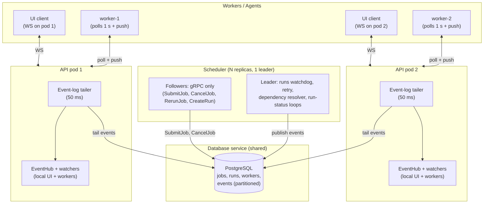

# Cdrom — High Availability Design

This document describes the design for making the Cdrom control plane
high-availability: multiple API pods, multiple scheduler replicas, and a
shared event log so that job delivery and live events work correctly
regardless of which pod a worker or UI client lands on.

> **Status:** implemented. The control plane is now HA-ready: a shared
> event log is the coordination bus, job delivery is hybrid push + pull
> (workers poll ~1 s as the authoritative path; API pods tail the log at
> ~50 ms and nudge local workers), the scheduler runs leader election so
> only one replica runs the four background loops, and cross-pod near-live
> logs use pointer events + range reads from the shared artifacts store.
> §1 describes the single-instance problem this design solves.

---

## 1. The problem

The control plane assumes a **single API instance**. Each API pod holds
per-pod in-memory state:

- `live` / `watchers` maps — the worker's `WatchJobs` stream and its group
  (`internal/api/grpc.go`, `GRPCServer` struct).
- `EventHub` — the WebSocket fan-out to the UI (`internal/api/events.go`).

Job delivery is a **one-shot push** from the scheduler into one pod's
in-memory map (`DispatchJob` → `dispatch()` iterates `s.live`). So:

- A worker connected to **API pod B** never receives a job dispatched via
  **API pod A** — the job is left `pending` with nothing to re-dispatch it.
- Every background loop's fan-out (watchdog, retry, dependency resolver,
  run-status, cancel) has the same hole: the scheduler dials **one** API
  address (`cfg.APIAddress`), so its `DispatchJob` / `NotifyJobStatus` /
  `NotifyRunStatus` / `CancelJob` calls reach only that pod.
- Running **>1 scheduler replica** without coordination causes **duplicate**
  dispatches and duplicate UI events (both replicas run all four loops).

The only shared state today is the Database service (PostgreSQL). Everything
that matters for delivery is per-pod memory.

---

## 2. The approach

**Hybrid push + pull, backed by a shared Postgres event log.** No Redis or
external broker is required. The API becomes a lightweight router; the
scheduler drops its API client for the push path and writes to the DB only.

| Mechanism | Role | Interval |
|-----------|------|----------|
| **Pull (authoritative)** | Workers poll pending-for-my-group from the shared DB. If a push is dropped (pod restart, stream flap, queue full), the next poll picks the job up. | ~1 s |
| **Push (fast path)** | Every API pod tails the shared event log and fans relevant events out to its *local* workers and UI subscribers. | ~50 ms |
| **Leader election** | One scheduler replica runs the four background loops (watchdog, retry, dependency resolver, run-status). Prevents duplicate event appends. | — |

Worst-case delivery latency is bounded by the 1 s poll, with a ~50 ms common
case. At-least-once delivery + idempotent consumption = exactly-once effect.

### Topology



The scheduler writes to the DB only. The API tails the DB. Workers and UI
clients talk to whichever API pod they land on. No component dials a specific
API pod by name.

---

## 3. Shared event log (the coordination bus)

A lean, append-only, **declaratively partitioned** table in PostgreSQL:

```sql
CREATE TABLE events (
    id          BIGINT GENERATED ALWAYS AS IDENTITY PRIMARY KEY,
    created_at  TIMESTAMPTZ NOT NULL DEFAULT now(),
    event_name  TEXT        NOT NULL,   -- assignment, job_status, run_status, worker, cancel, job_log_updated
    worker_group TEXT       NOT NULL DEFAULT '',  -- group filter (empty for log/status events)
    payload     JSONB       NOT NULL    -- small JSON: enough to handle the event, not the data
) PARTITION BY RANGE (created_at);

-- One partition per hour (or day); drop old partitions for retention.
CREATE TABLE events_2026100300 PARTITION OF events
    FOR VALUES FROM ('2026-10-03 00:00:00+00') TO ('2026-10-03 01:00:00+00');
```

### Event names and payloads

| `event_name` | `worker_group` | `payload` |
|---|---|---|
| `assignment` | target group | `{"job_id": 42}` |
| `cancel` | `""` | `{"job_id": 42}` |
| `job_status` | `""` | `{"job_id": 42, "status": "succeeded", "attempt": 1, "max_attempts": 3}` |
| `run_status` | `""` | `{"run_id": 7, "status": "failed"}` |
| `worker` | group | `{"name": "w-1", "action": "registered"}` |
| `job_log_updated` | `""` | `{"job_id": 42, "log": "job.log", "step_index": 1, "stream": "stdout", "size": 183422}` |

The table is **lean**: no log data, no job specs, no tokens. The payload is
small JSON — enough to *handle* the event (look up the job, range-read the
log delta), not the data itself.

### Key rules

- **Per-pod cursor.** Each API pod tracks one `last_id` (its position in the
  global log). On each 50 ms tick it queries `SELECT … FROM events WHERE id >
  :cursor ORDER BY id LIMIT :batch`, filters by `worker_group` against its
  local `live` map, fans out to local workers/UI, and advances the cursor.
  No per-worker offset tracking is needed: the worker's 1 s poll + idempotent
  claim already guarantees no job is lost.

- **State change + event append in one transaction.** New DB-service publish
  RPCs (`PublishAssignment`, `PublishJobStatus`, `PublishRunStatus`,
  `PublishWorkerEvent`, `PublishLogUpdated`) do `UPDATE jobs/runs/workers …;
  INSERT INTO events …` in a single transaction. An event exists *iff* the
  state changed — no row/event divergence.

- **Retention window > max consumer lag.** The log is a recent buffer; the DB
  state is the source of truth. A pod returning with a stale cursor (down
  longer than the retained window) **resyncs from a state snapshot** (current
  jobs/workers/runs from the DB) instead of replaying the log. Partition
  retention: drop partitions older than the window (e.g. 24 h for state
  events, shorter for `job_log_updated` since the durable full log lives in
  the artifacts store).

- **Cleanup via declarative partitioning.** `DROP TABLE events_YYYYMMDDHH`
  is O(1) — no bloat, no vacuum pressure. A background job (or a cron in the
  DB service) creates the next partition and drops expired ones.

---

## 4. Job dispatch (push + pull)

### Push: a nudge, not the assignment

The `assignment` event carries only `(job_id, target_group)` — **not** the
spec or the job token. On receiving the nudge (push *or* pull), the worker
calls `GetJob(job_id)` to fetch the fresh spec + token + upstream jobs. This
makes the log **replay-safe**: a replayed event can't carry a stale spec or an
expired token.

### Pull: the authoritative catch-up

The worker polls the API once per second. The API queries the shared DB for
pending jobs matching the worker's group and returns them. If a push was
dropped (queue full, pod restart, stream flap), the next poll picks the job
up. The worker's reconnect logic (backoff + full resync from the snapshot)
makes pod churn a normal event, not a failure.

### Idempotent claim

Before running a job, the worker atomically claims it:

```sql
UPDATE jobs SET status = 'running', started_at = now(), worker_id = :w
WHERE id = :job_id AND status = 'pending'
```

(same primitive as `ClaimJobRetry` / `ReapJob` / `SkipJob` / `CancelJob`). A
job delivered by **both** push and pull is claimed once; the duplicate is a
no-op. The claim is a new DB-service RPC (`ClaimJob`).

### Scheduler writes to DB only

The scheduler's `SubmitJob` persists the job and appends an `assignment`
event (via `PublishAssignment`). It does **not** call `DispatchJob` on a
specific API pod. The background loops (watchdog, retry, dependency resolver,
run-status) similarly publish events to the DB rather than calling
`NotifyJobStatus` / `DispatchJob` / `NotifyRunStatus` on the API. The API
becomes a pure consumer of the event log.

### Semantics: work-queue vs. broadcast

The current `dispatch()` pushes a group job to **every** live worker in the
group (broadcast — "run on all my nodes"). The claim primitive above is
work-queue (one worker claims, atomic). **Decision needed:**

- **Work-queue:** one worker in the group claims and runs the job. Simpler;
  matches the claim primitive.
- **Broadcast:** every worker in the group runs the job. No atomic claim;
  each worker tracks completed job IDs locally to avoid re-running. Matches
  today's `dispatch()` behavior.

The pull path must match whichever is chosen.

---

## 5. Live logs (near-live, cross-pod)

The bytes never touch PostgreSQL. The event is a **pointer**; the consumer
does a range read from the artifacts store.

### Publisher (the API pod that received the worker's `StreamJobLogs`)

After a successful `AppendLog` to the artifacts store, feed a small
**coalescer**: at most **one `job_log_updated` per (job, log) per ~200 ms**
(or per N KiB accumulated). The payload carries `size` = the log's total size
*after* the append (the publisher already knows it from the `AppendLog`
response). This removes the need for a `GetLog` metadata call on the consumer
side.

**Ordering:** append to the store *first*, then publish the event. Since logs
are append-only, a consumer that sees the event is guaranteed the bytes are
already in the store and `size` is accurate.

**Coalescing is safe** because the consumer tracks a byte offset: no matter
how many appends happened in the 200 ms window, the range read picks up
everything that accumulated.

### Consumer (each tailing API pod)

On `job_log_updated` for job X:

- **No local UI subscriber** watching X → **ignore** (no artifacts read).
- **Yes** → range-read `[cursor, size)` from the artifacts store (per
  `(job, log)` byte cursor), forward as the existing `job_log` WS event,
  advance the cursor.

**Same-pod fast path:** the pod that received the worker's `StreamJobLogs`
already has the bytes in hand — it publishes them directly to its local UI
subscribers (today's `EventHub` behavior, <50 ms). The event-log entry
exists purely for the *other* pods. So: same-pod UI is instant, cross-pod UI
is near-live.

**Catch-up:** a UI that connects (or reconnects) resyncs the full log from
the artifacts store (`DownloadLog` — the durable complete copy), then
continues on live events. A pod that was down and returns with a stale cursor
just range-reads a bigger chunk — append-only logs make any offset valid. If
the log file is gone (job cleaned up), the range read 404s and the pod drops
the tail; the UI already has the full log from resync.

### Required changes

1. **Proto:** add `int64 offset` to `DownloadLogRequest` (or a `TailLog` RPC)
   in `proto/cdrom/artifacts/v1/artifacts.proto`.
2. **Store interface:** `DownloadLogFrom(ctx, namespace, name, offset)` in
   `store.go`. Filesystem impl = open + `Seek(offset)` + read. S3 =
   `Range: bytes=offset-`. Azure = `x-ms-range`.
3. **API publisher:** in `handleLogChunk` (`internal/api/grpc.go`), after a
   successful append, feed the coalescer that appends `job_log_updated` to
   the event log (via the DB-service `PublishLogUpdated` RPC).
4. **API tailer:** the per-pod 50 ms loop gets a `job_log_updated` handler
   (per-`(job, log)` cursor map + range read + WS fan-out).

### Latency

- **Same-pod:** chunk → direct WS publish → **<50 ms**.
- **Cross-pod:** chunk → store append → event commit → ≤50 ms tail → range
  read → WS → **~100–300 ms**.

---

## 6. Shared artifacts store (cross-pod log reads)

The cross-pod reader has to be able to read the bytes the writer's pod
appended. Two options:

### Option A: shared filesystem (CephFS / NFSv4.1)

Keep the existing `filesystem` store kind; point `CDROM_ARTIFACTS_ROOT` at a
shared mount (a `ReadWriteMany` PVC backed by CephFS or NFSv4.1, e.g. EFS)
mounted by **every** artifacts replica. The store is stateless (metadata
derived from the file itself), so any replica can serve any read.

**Conditions (correctness requirements, not optimizations):**

1. **Close-per-append is a correctness requirement.** The current `AppendLog`
   does open → write → close per chunk. Both NFS and CephFS guarantee
   **close-to-open consistency**: once the writer closes, any other client's
   next *open* sees the new bytes. The reader (range-read in
   `DownloadLogFrom`) opens the file fresh per event, so it always sees
   everything the writer has closed. **Do not "optimize" away the per-chunk
   close** (e.g. a persistent open writer handle) — that would break
   close-to-open. Add a code comment so it doesn't get "fixed".
2. **Publish the event only after the close completes.** On NFS, Linux
   clients buffer writes in the local page cache and flush to the server on
   `close()` (or with a `sync` mount). Publish-after-close closes that gap.
3. **The reader must open fresh per read.** Don't cache an open fd across
   events on the tailing side — a long-lived fd on NFS/CephFS won't observe
   another client's writes until it's reopened.
4. **Prefer CephFS (or NFSv4.1) over NFSv3.** NFSv3 has weaker semantics
   (no mandatory locking, attribute-cache quirks).
5. **Don't rely on `GetLog`/stat for the live path.** NFS clients cache file
   *attributes* (size/mtime) for `actimeo` seconds. The design already
   avoids this — `size` comes from the event payload, not a local stat.

**Durability:** with close-per-chunk, each chunk is on the NFS/Ceph server
after the writer's close returns. A writer-pod crash loses at most the
in-flight chunk (same as today). For stricter durability (surviving *server*
failure), mount NFS `sync` — correct but slower; probably not worth it for
logs.

### Option B: S3 / Azure Blob (later)

The store interface (`internal/services/artifacts/store.go`) already has
`StoreKindS3` and `StoreKindAzureBlob` as reserved kinds. Implementing them
later removes the shared-filesystem dependency entirely. The `DownloadLogFrom`
range-read maps to `Range: bytes=offset-` (S3) or `x-ms-range` (Azure).

> **Decision:** implement with the shared filesystem (Option A) first. S3 /
> Azure Blob store implementations come later once the design is finalized.

---

## 7. Leader election (scheduler only)

Without leader election, N scheduler replicas all run the four background
loops and **duplicate the event appends** (two leaders both reap the same job
→ two `timed_out` events → duplicate UI notifications). The conditional DB
writes (`ReapJob`, `ClaimJobRetry`, `SkipJob`, `CancelJob`) are already
idempotent, but the *publishing* isn't.

**Mechanism:** a named, expiring **lease** row in the Database service
(`AcquireLease` / `ReleaseLease`, backed by a `leases` table). The lease is
portable across both supported backends (SQLite and PostgreSQL) — it is a
compare-and-swap on the row (claim if held by the caller or expired, else
insert, guarded by a unique constraint on the name), so no Postgres-specific
advisory lock is required. The scheduler acquires the lease on startup and
renews it every ~3 s (the lease TTL is ~10 s). Only the holder runs the four
loops. On lease loss (peer crash, network partition, or a transient DB
outage), the holder stops the loops; the new leader starts them. On a clean
shutdown the holder releases the lease so a peer can take over immediately
rather than waiting for the TTL to lapse.

The **API needs no leader election**: each pod appends only the events *it*
observed (a worker registering on pod B is published by pod B, once), so
there's no duplication.

---

## 8. What it fixes / what it doesn't

| Problem | Fixed? | How |
|---|---|---|
| Stranded `pending` / redispatch | ✅ | Pull is authoritative (1 s poll) |
| Worker on a different API pod | ✅ | Pull from shared DB; push via event log |
| Duplicate loops / fan-out (multi scheduler) | ✅ | Leader election |
| UI live events across pods | ✅ | Shared event log + per-pod tail |
| Near-live cross-pod logs | ✅ | Pointer event + range read from shared store |
| Cross-cluster tail latency | ⚠️ | Adds on top of the 50 ms floor (fine for dispatch) |
| Cross-pod *live* log latency | ⚠️ | ~100–300 ms (acceptable for a log console) |

---

## 9. Concrete changes

| Area | Change |
|---|---|
| `proto/cdrom/db/v1/db.proto` | `events` table + publish RPCs (`PublishAssignment`, `PublishCancel`, `PublishJobStatus`, `PublishRunStatus`, `PublishWorkerEvent`, `PublishLogUpdated`), `TailEvents(cursor, limit)`, `ClaimJob`, group-filtered pending query (`ListPendingByGroup`), and leader-election lease RPCs (`AcquireLease`, `ReleaseLease`) |
| `proto/cdrom/artifacts/v1/artifacts.proto` | `offset` on `DownloadLogRequest` (0 = whole log) |
| `internal/services/artifacts` | `Store.DownloadLog(ctx, ns, name, offset)`; filesystem = open + `Seek(offset)`; (S3/Azure later) |
| `internal/services/database` | `events` table + `leases` table; publish RPCs; `TailEvents`; `ClaimJob`; `ListPendingByGroup`; `AcquireLease` / `ReleaseLease` (portable compare-and-swap) |
| `internal/api` | Per-pod 50 ms tail loop (cursor + group filter + fan-out to `watchers` / `EventHub`); `job_log_updated` handler (cursor map + range read + WS); publisher coalescer in `handleLogChunk`; `ClaimJob` / `ListPendingJobs` RPCs; the one-shot `dispatch()` push is kept only as a same-pod fast path — the event log + worker poll are the source of truth |
| `internal/worker` | 1 s poll of pending-for-group + `GetJob` + atomic `ClaimJob`; robust reconnect (backoff + full resync) |
| `internal/services/scheduler` | Drop the API push client for dispatch; publish events to DB instead; add leader election (a portable lease on the Database service) gating the four loops |
| `internal/config` | Event-log tail interval, poll interval, retention window, store kind |

---

## 10. Suggested build order

1. **Event log** — partitioned table + retention DDL, DB-service publish/tail
   RPCs, transactional publish.
2. **API tail loop** — per-pod cursor + group filter + fan-out (replaces
   one-shot push as the source of truth).
3. **Worker poll + claim** — 1 s poll, `GetJob`, atomic `ClaimJob`.
4. **Scheduler leader election** — gate the four loops.
5. **Live logs** — `DownloadLogFrom` + `job_log_updated` pointer + coalescer
   + consumer range read.
6. **S3 / Azure Blob store** (later) — remove the shared-filesystem
   dependency.

---

## 11. Scale math

- **API pods:** ~4 per cluster (dual-cluster HA = 8 total). Each tails at
  50 ms → ~160 cheap `id > cursor` queries/sec against Postgres. Trivial.
- **Workers/agents:** many more than API pods. Each polls at 1 s → a few
  hundred `ListPendingByGroup` queries/sec at most. Trivial for Postgres.
- **Shared write path:** low-frequency state-event appends (assignments,
  status changes, worker lifecycle). Log events are coalesced to ≤1 per
  (job, log) per 200 ms.
- **Postgres is comfortably the right (and only) backing store.** No broker
  needed.
